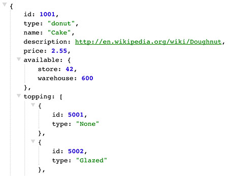

json-browse
===========


[](https://badge.fury.io/js/json-browse)
[](https://gemnasium.com/acidjazz/json-browse)


[](https://npmjs.org/package/json-browse)




*json-browse* is a jQuery plugin to easily browse and highlight your JSON.

* Syntax highlighting
* Collapse and expand child nodes on click
* Clickable links
* Easily readable and minimal DOM structure

[demo page](http://rawgit.com/acidjazz/json-browse/master/demo.html)!

## Usage

Import `jquery.json-browse.js` and `jquery.json-browse.css` in your application.

Then just call the `jsonBrowse()` method passing in an object:

```html
<pre id="json-renderer" class="json-body"></pre>
```

```js
var data = {
  "foobar": "foobaz"
};
$('#json-renderer').jsonBrowse(data);
```

## Options

The `jsonBrowse` method accepts an optional `options` hash as a second argument:

| Option     |   Type  | Default | Description                                              |
|------------|:-------:|--------:|----------------------------------------------------------|
| collapsed  | boolean |   false | All nodes are collapsed.                                 |
| withQuotes | boolean |   false | All JSON keys are surrounded with double quotation marks |

Example:

```js
$('#json-renderer').jsonBrowse(data, {collapsed: true, withQuotes: true});
```
